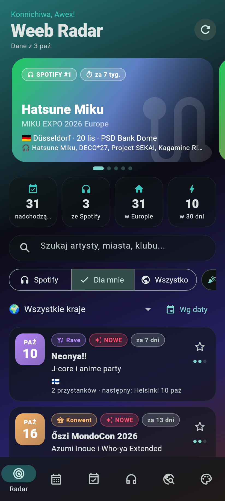
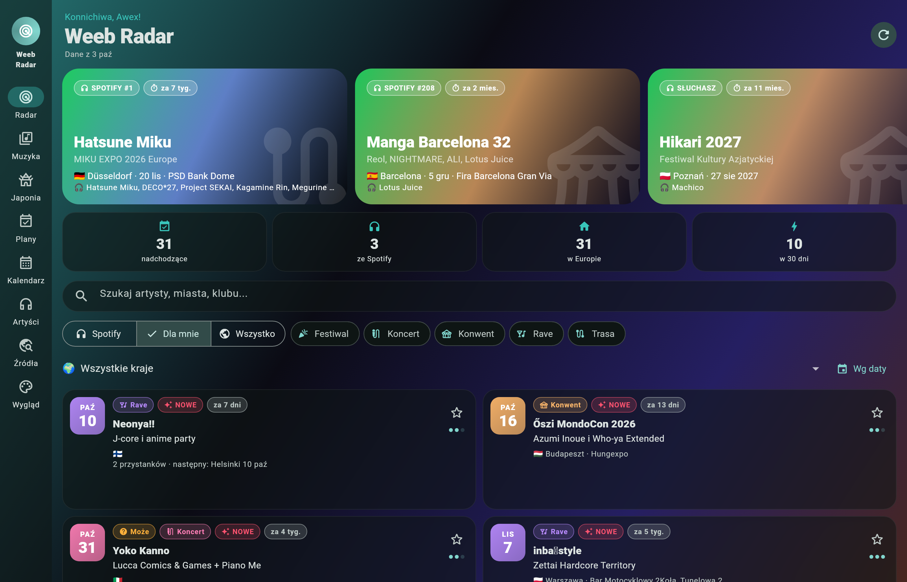
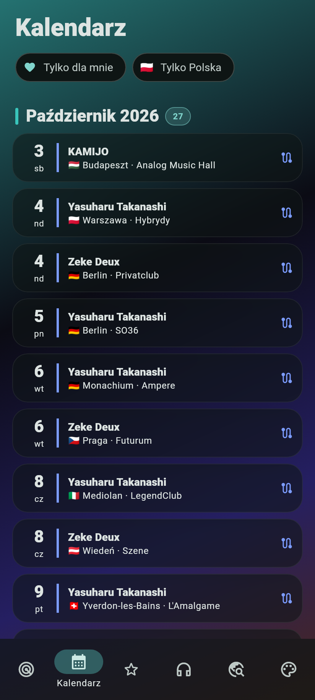
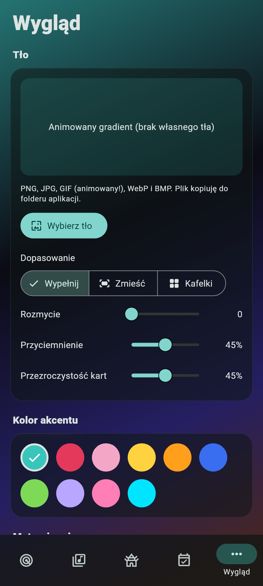
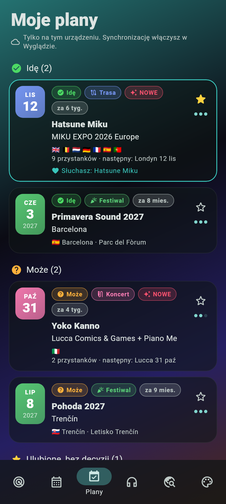
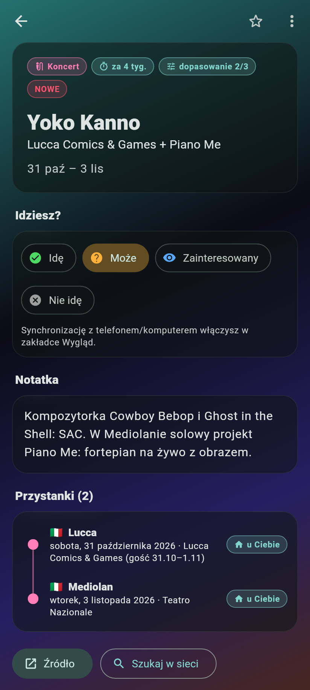

# Weeb Radar v2

Aplikacja na **Androida i Windowsa** (Flutter), która wyszukuje koncerty, trasy, konwenty i mniejsze eventy z japońską muzyką, vocaloidami i vtuberami, a potem podświetla te z artystami, których słuchasz.

| Telefon | Windows |
|---|---|
|  |  |
|  |  |
|  |  |

> Zrzuty są generowane w teście bez internetu, więc japońskie znaki wyglądają tam jak kwadraciki. W aplikacji działa font M PLUS Rounded 1c z pełnym japońskim.

## Co umie

- **Radar**: karuzela poleceń, statystyki, wyszukiwarka, filtry (Dla mnie / Wszystko, rodzaj, kraj), sortowanie po dacie albo dopasowaniu, odświeżanie przeciągnięciem.
- **Kalendarz**: każdy przystanek trasy osobno, pogrupowany miesiącami, z filtrem „tylko mój kraj”.
- **Plany**: przy każdym evencie „Idę / Może / Zainteresowany / Nie idę” plus gwiazdka. Zakładka „Plany” zbiera to w jednym miejscu; „Nie idę” jest przygaszone (albo schowane z „Dla mnie”, jeśli tak ustawisz).
- **Synchronizacja telefon ↔ komputer**: plany, gwiazdki i ukryte eventy siedzą w prywatnym GitHub Giście (plik `weeb-radar-sync.json`), bez żadnego serwera. Wygeneruj token na https://github.com/settings/personal-access-tokens/new z uprawnieniem *Account permissions → Gists → Read and write* (albo klasyczny token z zakresem `gist`) i wklej go w Wygląd → Synchronizacja na obu urządzeniach. Synchronizuje się przy starcie, przy odświeżeniu, po powrocie do apki i kilka sekund po każdej zmianie; przy konflikcie wygrywa nowsza zmiana.
- **Artyści**: lista startowa z Twojego Spotify plus słowa kluczowe (vocaloid, miku, vtuber, j-core...). Edytujesz ją w aplikacji.
- **Źródła**:
  - feed [`weeb-radar/events.json`](https://github.com/Alexsydfq/weeb-radar) (zapisywany w pamięci, działa offline),
  - VocaDB (eventy vocaloidowe, domyślnie tylko Europa),
  - dodatkowe feedy JSON w tym samym formacie,
  - skróty do małych eventów bez API (Vocafest UK & Ireland, MIKU EXPO, JaME, Tokyo Noizu) i własne eventy dodawane ręcznie.
- **Wygląd**: własne tło z pliku **PNG, JPG, GIF (animowany), WebP, BMP**, z rozmyciem, przyciemnieniem, trybem wypełnij/zmieść/kafelki, przezroczystością kart, 10 kolorami akcentu (Miku, Teto, Luka...), motywem jasnym/ciemnym i Twoim krajem.

## Pobieranie

GitHub Actions buduje oba warianty przy każdym pushu:

- Zakładka **Actions** → ostatni udany run „Build” → artefakty `WeebRadar-android` (APK) i `WeebRadar-windows` (zip, rozpakuj i uruchom `weeb_radar.exe`).
- Po wypchnięciu taga `v*` (np. `v1.0.0`) pliki lądują też w **Releases**.

APK jest podpisany kluczem debug, więc Android poprosi o zgodę na instalację z nieznanego źródła.

## Budowanie lokalnie

```bash
flutter pub get
flutter run                     # telefon / emulator
flutter run -d windows          # Windows (wymaga Visual Studio z C++)
flutter build apk --release
flutter build windows --release
flutter test test/
flutter test tool/screenshots/screenshots_test.dart --update-goldens   # odświeża zrzuty
```

## Format feedu

```json
{
  "updated": "2026-10-03T00:00:00Z",
  "events": [
    {
      "id": "unikalne-id",
      "artist": "Hatsune Miku",
      "title": "MIKU EXPO 2026 Europe",
      "kind": "trasa | koncert | konwent | rave | vocaloid",
      "tier": 3,
      "dateStart": "2026-11-12",
      "dateEnd": "2026-11-29",
      "note": "opis",
      "stops": [{ "cc": "PL", "city": "Warszawa", "date": "2026-11-20", "venue": "Klub" }],
      "url": "https://...",
      "tickets": "https://...",
      "foundAt": "2026-10-02"
    }
  ]
}
```

`tier` (1–3) to dopasowanie do gustu nadane przez skan; aplikacja dolicza do niego bonus za Twoich artystów, słowa kluczowe i Twój kraj.

## Prywatne repo

- **Weeb-radarv2** (kod apki) może być prywatne bez żadnych zmian. GitHub Actions na prywatnym repo ma na darmowym koncie 2000 minut miesięcznie (Windows liczy się podwójnie); jeden build to ok. 18 minut.
- **weeb-radar** (feed `events.json`) też może być prywatne: wtedy apka czyta feed przez API GitHuba tokenem z Wygląd → Synchronizacja. Token potrzebuje dodatkowo dostępu do repo `weeb-radar` (Repository permissions → Contents → Read-only).

